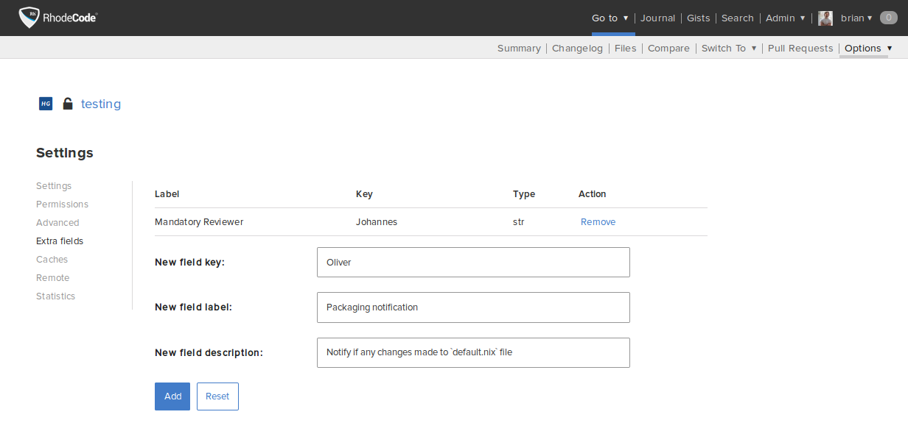

.. _repo-xtra:

Repository Extra Fields
=======================

Extra fields attached to a |repo| allow you to configure additional fields for
each repository. This allows storing custom data per-repository.

It can be used in :ref:`integrations-webhook` or in |RCX|.
To read more about |RCX|, see the :ref:`integrations-rcextensions` section.

Enabling Extra Fields
---------------------

To enable extra fields on |repos|, use the following steps:

1. Go to the :menuselection:`Admin --> Settings --> Visual` page.
2. Check the :guilabel:`Use repository extra fields` box.
3. Save your changes.

Configuring Extra Fields
------------------------

To configure extra fields per repository, use the following steps:

1. Go to :menuselection:`Admin --> Repositories` and select :guilabel:`Edit`
   beside the |repo| to which you wish to add extra fields.
2. On the |repo| settings page, select the :guilabel:`Extra fields` tab.

The most important is the `New field key` variable which under the value will
be stored. It needs to be unique for each repository. The label and description
will be generated in repository settings where users can actually save some
values inside generated extra fields.

Example Usage in extensions
---------------------------

To use the extra fields in an extension, see the example below. For more
information and examples, see the :ref:`extensions-hooks-ref` section.

.. code-block:: python

    call = load_extension('http_notify.py')
    if call:
        url = 'http://default.url' # <url for post data>

        # possibly extract the URL from extra fields
        call = load_extension('extra_fields.py')
        if call:
            repo_extra_fields = call(**kwargs)
            # now update if we have extra fields, they have precedence
            # this way users can store any configuration inside the database per
            # repo
            for key, data in repo_extra_fields.items():
                kwargs[key] = data['field_value']

        # an endpoint url data will be sent to, fetched from extra fields
        # if exists, or fallback to default
        kwargs['URL'] = kwargs.pop('webhook_url', None) or url

        # fetch pushed commits, from commit_ids list
        call = load_extension('extract_commits.py')
        extracted_commits = {}
        if call:
            extracted_commits = call(**kwargs)
            # store the commits for the next call chain
        kwargs['COMMITS'] = extracted_commits

        # set additional keys and values to be sent via POST to given URL
        kwargs['caller_type'] = 'rhodecode'
        kwargs['date'] = time.time() # import time before
        call(**kwargs)
