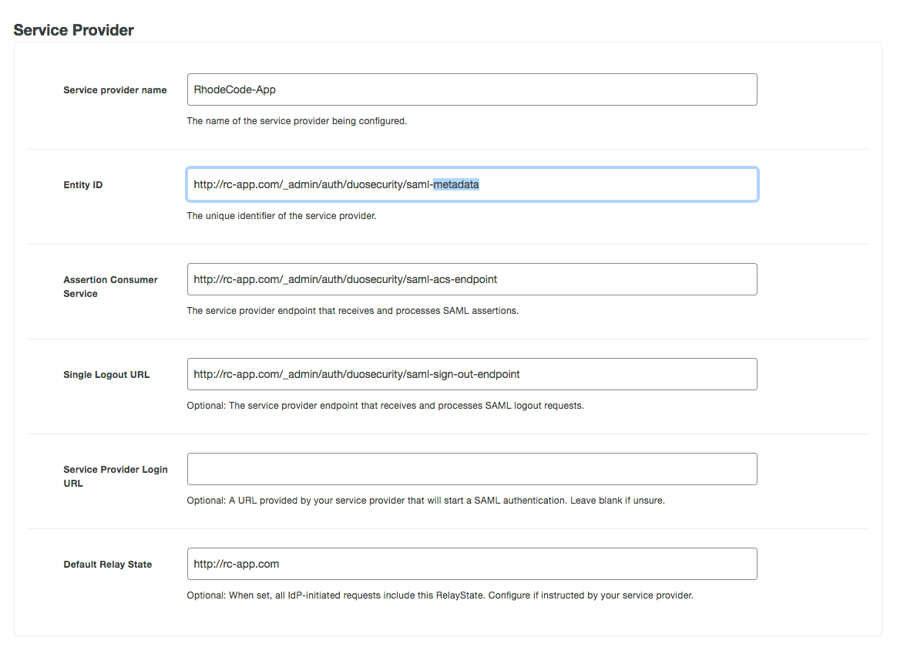
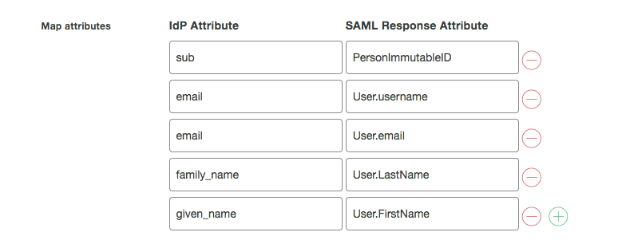

.. _config-saml-duosecurity-ref:

SAML 2.0 with Duo Security
--------------------------

**This plugin is available only in EE Edition.**

|RCE| supports SAML 2.0 Authentication with Duo Security provider. This allows
users to log-in to RhodeCode via SSO mechanism of external identity provider
such as Duo. The login can be triggered either by the external IDP, or internally
by clicking specific authentication button on the log-in page.

Configuration steps
^^^^^^^^^^^^^^^^^^^

To configure Duo Security SAML authentication, use the following steps:

1. From the |RCE| interface, select
   :menuselection:`Admin --> Authentication`
2. Activate the `Duo Security` plugin and select :guilabel:`Save`
3. Go to newly available menu option called `Duo Security` on the left side.
4. Check the `enabled` check box in the plugin configuration section,
   and fill in the required SAML information and :guilabel:`Save`, for more details,
   see :ref:`config-saml-duosecurity`

.. _config-saml-duosecurity:

Example SAML Duo Security configuration
^^^^^^^^^^^^^^^^^^^^^^^^^^^^^^^^^^^^^^^

Example configuration for SAML 2.0 with Duo Security provider::

    *option*: `enabled` => `True`
    # Enable or disable this authentication plugin.

    *option*: `cache_ttl` => `0`
    # Amount of seconds to cache the authentication and permissions check response call for this plugin.
    # Useful for expensive calls like LDAP to improve the performance of the system (0 means disabled).

    *option*: `debug` => `True`
    # Enable or disable debug mode that shows SAML errors in the RhodeCode logs.

    *option*: `entity_id` => `http://rc-app.com/dag/saml2/idp/metadata.php`
    # Identity Provider entity/metadata URI.
    # E.g. https://duo-gateway.com/dag/saml2/idp/metadata.php

    *option*: `sso_service_url` => `http://rc-app.com/dag/saml2/idp/SSOService.php?spentityid=http://rc.local.pl/_admin/auth/duosecurity/saml-metadata`
    # SSO (SingleSignOn) endpoint URL of the IdP. This can be used to initialize login
    # E.g. https://duo-gateway.com/dag/saml2/idp/SSOService.php?spentityid=<metadata_entity_id>

    *option*: `slo_service_url` => `http://rc-app.com/dag/saml2/idp/SingleLogoutService.php?ReturnTo=http://rc-app.com/dag/module.php/duosecurity/logout.php`
    # SLO (SingleLogout) endpoint URL of the IdP.
    # E.g. https://duo-gateway.com/dag/saml2/idp/SingleLogoutService.php?ReturnTo=http://duo-gateway.com/_admin/saml/sign-out-endpoint

    *option*: `x509cert` => `<CERTIFICATE_STRING>`
    # Identity provider public x509 certificate. It will be converted to single-line format without headers

    *option*: `name_id_format` => `sha-1`
    # The format that specifies how the NameID is sent to the service provider.

    *option*: `signature_algo` => `sha-256`
    # Type of Algorithm to use for verification of SAML signature on Identity provider side

    *option*: `digest_algo` => `sha-256`
    # Type of Algorithm to use for verification of SAML digest on Identity provider side

    *option*: `cert_dir` => `/etc/saml/`
    # Optional directory to store service provider certificate and private keys.
    # Expected certs for the SP should be stored in this folder as:
    #  * sp.key     Private Key
    #  * sp.crt     Public cert
    #  * sp_new.crt Future Public cert
    #
    # Also you can use other cert to sign the metadata of the SP using the:
    #  * metadata.key
    #  * metadata.crt

    *option*: `user_id_attribute` => `PersonImmutableID`
    # User ID Attribute name. This defines which attribute in SAML response will be used to link accounts via unique id.
    # Ensure this is returned from DuoSecurity for example via duo_username

    *option*: `username_attribute` => `User.username`
    # Username Attribute name. This defines which attribute in SAML response will map to an username.

    *option*: `email_attribute` => `User.email`
    # Email Attribute name. This defines which attribute in SAML response will map to an email address.

Below is example setup from DUO Administration page that can be used with above config.

Below is an example attribute mapping set for IDP provider required by the above config.

