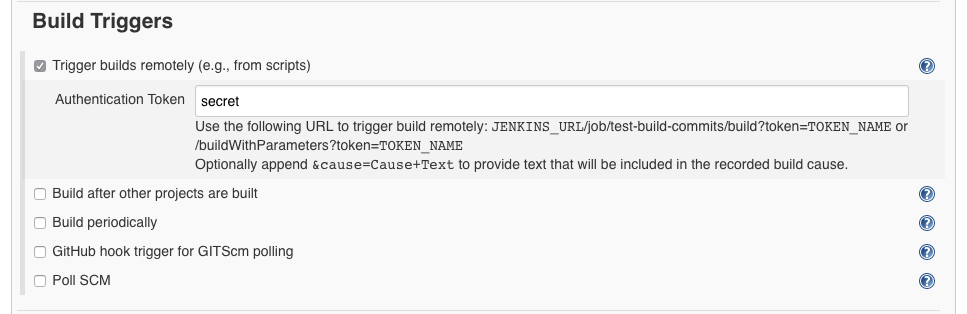
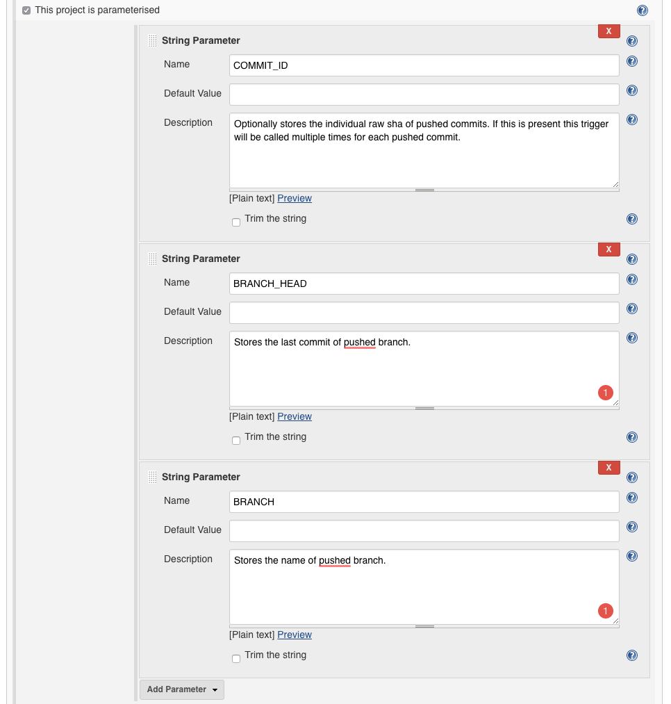
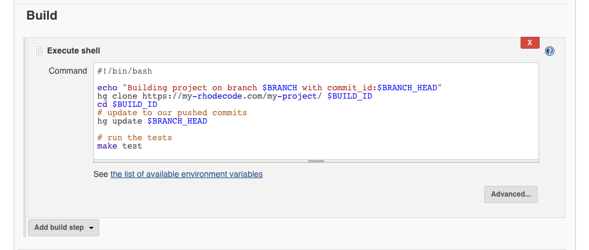
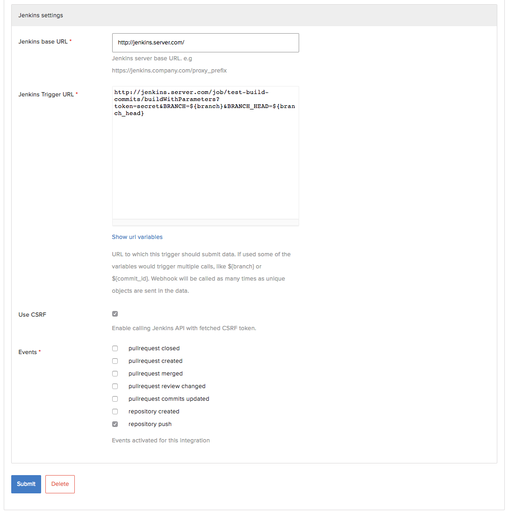
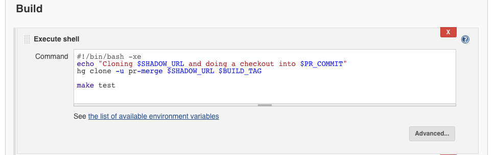

.. _integrations-jenkins:

Jenkins integration
===================

.. important::

    Jenkins integration is only available in |RCEE|.

Below are few examples how to use dedicated Jenkins integrations with |RCEE|.

Configure Jenkins to check each commit after push
^^^^^^^^^^^^^^^^^^^^^^^^^^^^^^^^^^^^^^^^^^^^^^^^^

In order to configure Jenkins to trigger a build on a project after each push we
need to create a project that will allow triggering a build from external sources.

In Jenkins, check `Trigger builds remotely (e.g., from scripts)` option. This gives
now ability to trigger builds using an URL.

We also need to specify the parameters we're going to build the project with.
In this example we'll use build with 3 parameters `COMMIT_ID`, `BRANCH_HEAD` and `BRANCH`.
In Jenkins we need to add those 3 parameters, and check an option
`This project is parameterised`

Our final URL that |RCEE| Jenkins integration would use could look like this:

This URL will be triggered for each pushed branch, and will include the branch head commit id.

https://jenkins.server.com/job/test-build-commits/buildWithParameters?token=secret&BRANCH=${branch}&BRANCH_HEAD=${branch_head}

Or we can also use commit_id in this case URL will be triggered for each pushed commit in the branch, and will include the commit id.

https://jenkins.server.com/job/test-build-commits/buildWithParameters?token=secret&BRANCH=${branch}&COMMIT_ID=${commit_id}

Now we have all the required information to fetch/checkout and test our project.
We can write an example build common in Jenkins.

Below is an example of the integration page we used on |RCEE| side.

Configure Jenkins to check each pull-request on creation and updates
^^^^^^^^^^^^^^^^^^^^^^^^^^^^^^^^^^^^^^^^^^^^^^^^^^^^^^^^^^^^^^^^^^^^

Jenkins integration also allows checking created pull-requests inside |RCCE|. This is
somehow a special case compared to testing commits. The pull-requests cannot be cloned
from the repository. Instead |RCCE| exposes different links back to CI systems which
store information on how to obtain the pull-request code.

On |RCCE| side we need to create a new integration that would use only two events:

 - pullrequest created
 - pullrequest commits updated

This will trigger the builds when pull-request is firstly created, and then each time
pull-requests is updated and commits that it stores change.

In Jenkins, we should create at least two new build string parameters.
We could use `PR_ID` and `SHADOW_URL`.
Using those parameters, we can then create a customized build command to checkout a
merged state of pull-request. And later on using rhodecode-api notify about the checks
using the `PR_ID`.

There's even a helper script we created to send notifications.
Here's how the build on success could look like in Jenkins.

.. code-block:: bash

    # clone the ci-notify script, and save it into our $BUILD_TAG/notify directory
    hg clone https://code.rhodecode.com/ci-notify $BUILD_TAG/notify

    # execute the script. $RC_TOKEN is auth-token for API
    # url is your rhodecode instance, repoid is repository project which PR was opened
    # status could be "approved" or "rejected"
    python $BUILD_TAG/notify/notify.py \
        --token $RC_TOKEN \
        --url https://code.server.com \
        --repoid my-example-project \
        --prid $PR_ID \
        --status "approved" \
        --message "Build Succeeded: $BUILD_URL"

Below is also an example that we could use on |RCCE| side in the Jenkins integration settings.
A Jenkins Trigger url that exposes all required information back to Jenkins CI server:

.. code-block:: bash

    http://jenkins.server.com/job/my-project-pull-request-tests/buildWithParameters?token=secret&PR_ID=${pull_request_id}&PR_TITLE=${pull_request_title}&SHADOW_URL=${pull_request_shadow_url}&PR_UID=${pull_request_commits_uid}

